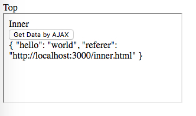

JavaScript Call Top JQuery From Inner IFrame Demo
=================================================

如果我们在内部iframe的JavaScript中，直接引用top的jquery去发送AJAX请求，从服务器端看到的Referer是外窗口的。
原因是JQuery使用的`xhr`是基于它所持有的`window`对象：

```
jQuery.ajaxSettings.xhr = function() {
	try {
		return new window.XMLHttpRequest();
	} catch ( e ) {}
};
```

(来自<https://github.com/jquery/jquery/blob/e743cbd28553267f955f71ea7248377915613fd9/src/ajax/xhr.js>)

如果JQuery在外层，那么这个`window`对象也是外层的，所以虽然我们是在iframe中调用`$.ajax`，但它最终还是从外层窗口发出。

所以我们需要给它提供一个基于内层window的xhr供调用：

```
$.ajax({
  url: '...',
  xhr: function () {
    return new window.XMLHttpRequest()
  }
})
```

运行：

```
npm install
npm run demo
```


